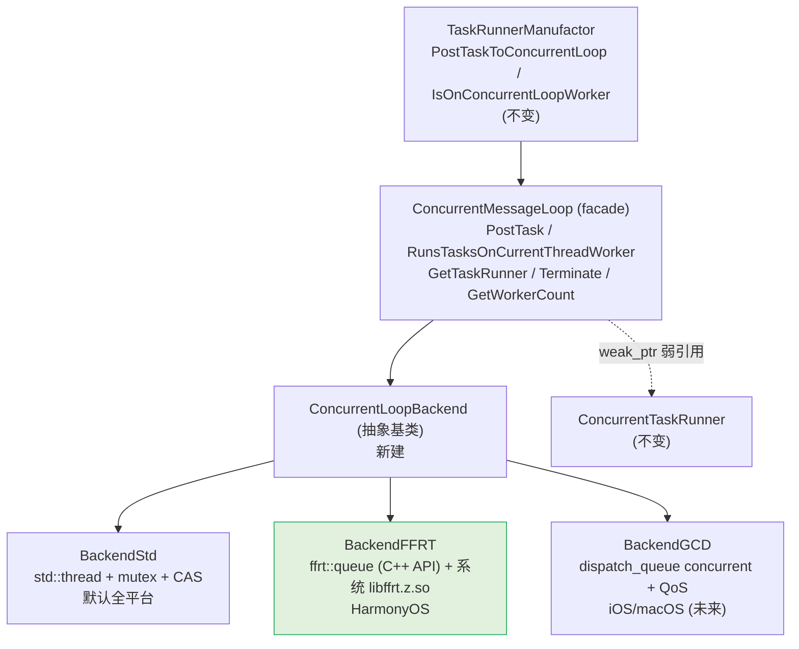

# ConcurrentMessageLoop 后端化 Spec（FFRT / GCD / Std）

> Status: Draft · 模块: `base/fml` · 2026-07-10
>
> 本 spec 聚焦「叶子任务并发池」(`ConcurrentMessageLoop`) 的后端化重构，**本期交付物是 HarmonyOS 上的 FFRT 后端**；iOS 的 GCD 后端与默认 std 后端为多平台解耦而设计，本期不实现 GCD。背景可对照「TASM 线程为何不用线程池」——TASM 走固定线程 + Actor，与这里的并发池是两条独立路径。

## 1. 背景与动机

`ConcurrentMessageLoop`（`base/include/fml/concurrent_message_loop.h`）是 Lynx 跑「无状态可并行叶子任务」（图像解码 / 字体处理 / 资源加载）的并发池，由 `TaskRunnerManufactor` 按优先级建两个实例：`LynxHighTask` / `LynxNormalTask`。

当前实现是一套手写的 `std::thread` 池（mutex + 原子 CAS 抢占 + 错峰唤醒 + 自适应休眠 + iOS autoreleasepool），**全平台共用一份代码**。问题：

- **HarmonyOS 上无 OS 级优先级**：`thread_config_setter` 没有 Harmony 实现，worker 只在 thread name 上做标记，不接入鸿蒙资源调度（thermal / 电池 / 内存压力感知）。
- **平台差异硬编码在通用文件里**：`concurrent_message_loop.cc` 里散落 `#if defined(OS_IOS)` 等分支，难扩展。
- **无法对接平台原生并发基础设施**：Harmony 的 FFRT、iOS 的 GCD 都更贴合各自平台的调度语义与可观测性工具。

## 2. 目标 / 非目标

**目标**

- G1：`ConcurrentMessageLoop` 改为 facade，引入 `ConcurrentLoopBackend` 抽象，**上游 API 与调用方零改动**。
- G2：HarmonyOS 平台后端用 FFRT，**纯 C++ 接口**（`ffrt::queue`、`ffrt::queue_attr`、`ffrt::task_attr`），对接系统核心 `libffrt.z.so`。
- G3：抽象按「≥2 个后端」设计（FFRT + GCD），即使本期只实现 FFRT，也要保证 GCD 后续可零侵入加入。
- G4：其他平台（Android / Linux / Windows）行为**零变化**——现有 std 池逻辑整体平移为 `BackendStd`。

**非目标**

- N1：不替换 TASM / JS / UI 线程模型（它们走 `LynxActor` + 固定 runner，不经过并发池）。
- N2：不追求 benchmark 性能数字（并发池跑的是 ms 级叶子任务，调度开销占比 <0.1%）。
- N3：本期不实现 GCD 后端（仅设计预留）。

## 3. 平台识别机制（确认）

**编译期平台宏分发**，与现有 `MessageLoop*` / `thread_config_setter` 完全一致：

| 平台宏                                              | 后端          | 状态                 |
| --------------------------------------------------- | ------------- | -------------------- |
| `OS_HARMONY`                                        | `BackendFFRT` | 本期实现             |
| `OS_IOS` / `OS_OSX`                                 | `BackendGCD`  | 设计预留，本期不实现 |
| 其他（`OS_ANDROID` / `OS_LINUX` / `OS_WIN` / 默认） | `BackendStd`  | 现实现平移           |

无需运行时探测。工厂函数内用 `#if defined(...)` 选后端。

## 4. 总体架构



分层原则：**facade 持有 backend 独占所有权并负责跨后端统一的横切策略（shutdown 兜底）；backend 只负责「把 closure 跑在它的执行器上」+ 自报线程归属。**

## 5. 核心抽象：`ConcurrentLoopBackend`

新建 `base/include/fml/concurrent_message_loop_backend.h`：

```cpp
namespace lynx::fml {

class ConcurrentLoopBackend {
 public:
  virtual ~ConcurrentLoopBackend() = default;

  // 在后端执行器上异步执行 task。task 永不为空、永不在 shutdown 后调用
  // （shutdown 期 PostTask 由 facade 在调用前拦截，见 §9）。
  virtual void PostTask(base::closure task) = 0;

  // 当前线程是否正运行本后端的一个任务。
  virtual bool RunsTasksOnCurrentThreadWorker() const = 0;

  virtual size_t GetWorkerCount() const = 0;

  // 停止接收新任务，等待已在执行的任务结束后回收资源。
  virtual void Terminate() = 0;
};

// 工厂：编译期按平台 + OHOS API 版本选后端。优先级/worker 数在构造时传入。
std::unique_ptr<ConcurrentLoopBackend> CreateConcurrentLoopBackend(
    const std::string& name_prefix,
    Thread::ThreadPriority priority,
    size_t worker_count);

}  // namespace lynx::fml
```

工厂实现（`concurrent_message_loop_backend.cc`）——注：BackendFFRT 用 `thread_mode(true)` 需 OHOS API ≥ 20（假定 Lynx 鸿蒙目标机器 ≥ HarmonyOS 6.0，详见 §12.6）：

```cpp
std::unique_ptr<ConcurrentLoopBackend> CreateConcurrentLoopBackend(
    const std::string& name_prefix, Thread::ThreadPriority priority,
    size_t worker_count) {
#if defined(OS_HARMONY)
  return std::make_unique<ConcurrentLoopBackendFFRT>(
      name_prefix, priority, worker_count);
#elif defined(OS_IOS) || defined(OS_OSX)
  return std::make_unique<ConcurrentLoopBackendGCD>(
      name_prefix, priority, worker_count);
#else
  return std::make_unique<ConcurrentLoopBackendStd>(
      name_prefix, priority, worker_count);
#endif
}
```

> [!NOTE]
> 为什么 `RunsTasksOnCurrentThreadWorker` 是 backend 的虚方法：不同后端判定「当前线程是否在跑本池任务」的方式不同（Std 用 thread-local 线程级哨兵；FFRT/GCD 用任务级哨兵），交给各后端自管最干净，facade 仅转发。

## 6. `ConcurrentMessageLoop` facade 改造

`ConcurrentMessageLoop` 退化为薄外观，**公共 API 不变**：

```cpp
class ConcurrentMessageLoop : public std::enable_shared_from_this<...> {
 public:
  // 公共 API 签名完全不变
  void PostTask(base::closure task);
  bool RunsTasksOnCurrentThreadWorker() const { return backend_->RunsTasksOnCurrentThreadWorker(); }
  size_t GetWorkerCount() const { return backend_->GetWorkerCount(); }
  std::shared_ptr<ConcurrentTaskRunner> GetTaskRunner();   // 不变
  void Terminate();

 private:
  std::unique_ptr<ConcurrentLoopBackend> backend_;
  std::atomic_bool shutdown_{false};   // facade 持有，跨后端统一兜底
};
```

`PostTask` 与 `Terminate` 的 facade 逻辑：

```cpp
void ConcurrentMessageLoop::PostTask(base::closure task) {
  if (!task) return;
  if (shutdown_.load()) { task(); return; }   // shutdown 期同步跑，不丢任务（跨后端统一）
  backend_->PostTask(std::move(task));
}

void ConcurrentMessageLoop::Terminate() {
  shutdown_.store(true);
  backend_->Terminate();
}
```

`ConcurrentTaskRunner`（`weak_ptr<ConcurrentMessageLoop>` 包装层）**完全不变**——它只调 `loop->PostTask`。因此 `TaskRunnerManufactor::PostTaskToConcurrentLoop` / `IsOnConcurrentLoopWorker` / `GetConcurrentLoop` **全部不变**。

## 7. 三个后端

### 7.1 `BackendStd`（默认全平台，行为零变化）

把现 `concurrent_message_loop.cc` 里的 `workers_` / `tasks_` / `tasks_mutex_` / `task_count_` / `worker_count_` / `notify_mutex_` / `notify_condition_` / `shutdown_` / `WorkerMain` **整体平移**到 `BackendStd`，包括：

- iOS autoreleasepool 包裹（`objc_autoreleasePoolPush/Pop`）；
- `PlatformThreadPriority::Setter`（iOS/Android）或 `SetCurrentThreadName`（其他）；
- CAS 抢占 + 错峰唤醒 + 自适应休眠；
- `thread_local` 线程级哨兵（在 `WorkerMain` 进入时设、退出时清）。

> [!IMPORTANT]
> `BackendStd` 必须保持现有行为 1:1。这是「其他平台零影响」的保证。平移是纯搬运 + 改名，不改逻辑。回归用现有测试覆盖。

### 7.2 `BackendFFRT`（HarmonyOS，本期交付）

新建 `base/src/fml/platform/harmony/concurrent_loop_backend_ffrt.{h,cc}`。

**FFRT 认知要点**：

- FFRT 是 task-based 并发框架，核心 API 是 `ffrt::queue`（C++ wrapper）或 `ffrt_queue_*`（C）。
- **FFRT C++ 接口是纯头文件**：`ffrt::queue_attr` / `ffrt::queue` 等是 `ffrt_queue_attr_t` / `ffrt_queue_t` 的 RAII + inline 包装（`cpp/queue.h` 全是 `inline`），编译进调用方，**不需要链接 `libffrt_cpp.so`**。
- 运行时核心是**系统 `libffrt.z.so`**（`FunctionFlowRuntimeKit`，设备自带），按名链接。
- 并发队列的 `max_concurrency` 控制单队列并发度；`qos(level)` 控制资源供给等级；`thread_mode(true)`（API 20+）切换线程模式。

```cpp
class ConcurrentLoopBackendFFRT : public ConcurrentLoopBackend {
 public:
  ConcurrentLoopBackendFFRT(const std::string& name,
                            Thread::ThreadPriority priority,
                            size_t worker_count)
      : worker_count_(worker_count) {
    // queue_attr's copy ctor is deleted, so bind the chain expression
    // directly to ffrt::queue (no intermediate local).
    queue_ = std::make_unique<ffrt::queue>(
        ffrt::queue_concurrent,
        name.c_str(),
        ffrt::queue_attr()
            .max_concurrency(static_cast<int>(worker_count))    // worker 数 → 队列并发度
            .qos(MapQos(priority))                             // 队列级 QoS
            .thread_mode(true));  // 永久线程模式（理由见设计决策 #5）
  }

  ~ConcurrentLoopBackendFFRT() override = default;   // ffrt::queue RAII → ffrt_queue_destroy

  void PostTask(base::closure task) override {
    // ffrt::queue::submit needs a CopyConstructible callable, but
    // base::closure is move-only, so wrap it in a shared_ptr.
    auto shared_task = std::make_shared<base::closure>(std::move(task));
    // 任务级哨兵：进入任务设、退出清（替代 BackendStd 的线程级哨兵）
    auto wrapped = [this, shared_task]() {
      g_current_worker = this;
      (*shared_task)();
      g_current_worker = nullptr;
    };
    queue_->submit(std::move(wrapped));  // fire-and-forget，C++ API 内部转 create_function_wrapper
  }

  bool RunsTasksOnCurrentThreadWorker() const override {
    return g_current_worker == this;
  }

  size_t GetWorkerCount() const override { return worker_count_; }

  void Terminate() override { queue_.reset(); }   // 触发 RAII 析构

 private:
  // MapQos is defined in the anonymous namespace below this class
  // (file-scope; no need to be a class member).
  std::unique_ptr<ffrt::queue> queue_;
  size_t worker_count_;
  // 进程内唯一哨兵（编译期单后端，不会与其他后端共存）
  static thread_local ConcurrentLoopBackendFFRT* g_current_worker;
};

namespace {
// HIGH → qos_user_initiated (highest user-initiated QoS class).
ffrt::qos MapQos(Thread::ThreadPriority p) {
  switch (p) {
    case Thread::ThreadPriority::HIGH:
      return ffrt::qos_user_initiated;
    case Thread::ThreadPriority::LOW:
    case Thread::ThreadPriority::BACKGROUND:
      return ffrt::qos_background;
    case Thread::ThreadPriority::NORMAL:
    default:
      return ffrt::qos_default;
  }
}
}  // namespace
```

**关键设计决策**

1. **C++ 接口全程**（不用 C `ffrt_queue_*`）：`ffrt::queue_attr` / `ffrt::queue` 都是 RAII，`submit(std::function&&)` 直接接受 lambda（内部封装 `create_function_wrapper`），无需手写 `ffrt_function_header_t`，无需 `ffrt_task_attr_init/destroy` 等样板。
2. **两池各自一个 `ffrt::queue`**：`LynxHighTask` / `LynxNormalTask` 各建一个 concurrent 队列，分别设 `ffrt::qos_user_initiated`（HIGH）/ `ffrt::qos_default`（NORMAL）。HIGH 与 NORMAL 拉开 2 档差距，便于 FFRT 在 worker 饱和时做明显调度区分。**不用同队列内的 queue_priority**（避免高优先级插队饿死低优先级）。
3. **worker 数 = `max_concurrency`**：直接映射。
4. **FFRT 共享 worker 池**：两个队列都从 FFRT 运行时的共享 worker 池调度，由 FFRT 按 QoS 仲裁——与 BackendStd「每池独占线程」不同，但呼应 FFRT「集约化管理线程」的设计目标，减少总线程数。
5. **线程模式（`thread_mode(true)`）永久开启**：
   - **任务级 `thread_local` 哨兵**需要每任务独占 OS 线程上下文，协程模式下多任务共享线程会覆盖哨兵；
   - **更根本**：**无法假设上层 task 内部不使用 `thread_local`**——团队的编码规范可能禁止协程栈上的 `thread_local`，JS 任务封装等场景也无此保证。线程模式是不依赖业务约定的**安全默认**，FFRT 利用率的少量损失（在 ms 级叶子任务场景几乎可忽略）换来普遍正确性。
   - **OHOS API 基线**：`thread_mode(true)` 需 OHOS API ≥ 20；当前假定 HarmonyOS 6.0+ 设备已满足，若未来遇老机型再补 fallback（见 §12.6）。
6. **shutdown 语义**：`ffrt::queue` 析构（`queue_.reset()`）触发 `ffrt_queue_destroy`，等待在跑任务结束。shutdown 期的 `PostTask` 已由 facade 拦截同步执行，不会到达后端。

### 7.3 `BackendGCD`（iOS / macOS，本期不实现）

仅作设计预留，证明抽象对 GCD 也成立：

- `dispatch_queue_create(name, DISPATCH_QUEUE_CONCURRENT_WITH_AUTORELEASE_POOL)`（iOS 10+/macOS 10.9+），GCD 自动包 autoreleasepool，**删除手写 push/pop**。
- `dispatch_set_qos_class_floor(queue, QOS_CLASS_USER_INITIATED / QOS_CLASS_DEFAULT, 0)` 在创建时设 QoS，block 自动继承。
- `PostTask`：`dispatch_async(queue, ...)`，block 内设 / 清任务级哨兵。
- `RunsTasksOnCurrentThreadWorker`：哨兵判定。
- `Terminate`：`dispatch_release`（ARC 下由 wrapper 持有）。
- **并发度差异**：GCD concurrent queue 不强制硬上限，由系统按负载决定并行度。若需硬上限，在 wrapper 加计数信号量。Lynx 叶子任务场景无需硬上限。

## 8. 横切关注点总表

| 关注点          | BackendStd                                        | BackendFFRT                                                            | BackendGCD                             |
| --------------- | ------------------------------------------------- | ---------------------------------------------------------------------- | -------------------------------------- |
| 执行器          | N 个 `std::thread`                                | 1 个 `ffrt::queue`（max_concurrency=N），共享 FFRT 池                  | 1 个 dispatch concurrent queue         |
| 优先级落地      | `setpriority` / `pthread_set_qos_class`（每线程） | 队列级 `ffrt::qos_*`                                                   | 队列级 `dispatch_set_qos_class_floor`  |
| 线程归属判定    | 线程级 thread-local 哨兵（进/出 WorkerMain）      | 任务级 thread-local 哨兵（任务包装）                                   | 任务级 thread-local 哨兵（block 包装） |
| 任务顺序        | 严格 FIFO                                         | 同优先级 FIFO（FFRT 调度器内）                                         | 无保证（GCD 调度）                     |
| autoreleasepool | iOS 手写 push/pop                                 | 无需                                                                   | 队列 flag 自动                         |
| shutdown 兜底   | facade 拦截 → 调用方同步跑                        | 同左                                                                   | 同左                                   |
| 线程命名        | `name_prefix + i`                                 | FFRT 按队列名命名                                                      | dispatch label                         |
| 链接 .so        | 无（用 std）                                      | **不链 `libffrt_cpp.so`**（头文件即编译完），链系统 `libffrt.z.so`     | 系统 GCD                               |
| 线程模式        | N/A                                               | **`thread_mode(true)` 永久开启**（理由见 §7.2 #5；隐含 OHOS API ≥ 20） | N/A                                    |

## 9. 对其他平台的影响

> [!NOTE]
> 结论：Android / Linux / Windows 零行为变化。这些平台编译期落到 `BackendStd`，而 `BackendStd` 是现实现的**逐字平移**（含 iOS autoreleasepool 分支——Android/Linux/Windows 本来就走非 iOS 分支，不受影响）。iOS 本期不实现 GCD，仍走 `BackendStd`，行为与现状一致。

- **公共 API 不变**：`ConcurrentMessageLoop::PostTask` / `RunsTasksOnCurrentThreadWorker` / `GetTaskRunner` / `Terminate` 签名不变。
- **上游不变**：`ConcurrentTaskRunner`、`TaskRunnerManufactor::PostTaskToConcurrentLoop` / `IsOnConcurrentLoopWorker` / `GetConcurrentLoop` 不变。
- **唯一风险**：facade 平移过程中的纯重构回归——靠现有单测 + 新增契约测试覆盖。

## 10. 行为合同（Contract）

所有后端必须满足：

- **C1 不丢任务**：非 shutdown 期 `PostTask` 必最终执行一次且仅一次。
- **C2 shutdown 兜底**：`Terminate` 后再 `PostTask`，任务在调用方线程同步执行（由 facade 保证）。
- **C3 worker 自识别**：任务执行期间 `RunsTasksOnCurrentThreadWorker() == true`；非任务上下文 == false。
- **C4 优雅终止**：`Terminate` 等待在跑任务结束后才回收资源。
- **C5 worker 数**：`GetWorkerCount()` 返回构造时传入值（GCD 仅作记录，不强制）。

> [!WARNING]
> 顺序合同（C6）当前只有 BackendStd 满足严格 FIFO。Lynx 调用方**是否依赖严格 FIFO** 需审计（见 §11 OQ-3）。若无依赖，C6 不列为强合同；若有，FFRT/GCD 需在 wrapper 内加序号保序。

## 11. 风险与开放问题

| 编号 | 问题                                                                                        | 影响                                                                                                                                   | 处置                                                       | 状态（Phase 2 收尾）                                                                                                                                                                                                                                                                                                              |
| ---- | ------------------------------------------------------------------------------------------- | -------------------------------------------------------------------------------------------------------------------------------------- | ---------------------------------------------------------- | --------------------------------------------------------------------------------------------------------------------------------------------------------------------------------------------------------------------------------------------------------------------------------------------------------------------------------- |
| OQ-1 | `IsOnConcurrentLoopWorker` 是否有关键调用方？                                               | 与线程模式选择**解耦**（线程模式已定为永久安全默认，与哨兵无关）；仅决定后端自识别机制 / task 级哨兵是否还需保留——若长期无人调用可简化 | **P0 先做调用方审计**（不阻塞 FFRT 落地，作为后续清理项）  | **审计完成**。T1 审计：2 处生产调用方均在 `core/runtime/js/bytecode/js_cache_manager.cc`——`#490`（正确：哨兵走 fast-path，避免再 post）与 `#721`（**有 bug**：哨兵命中后先 `task()` 同步执行又立刻 `PostTaskToConcurrentLoop` 同一闭包，造成 double-execute）。该 bug 不在 Phase 2 scope 内，作为后续清理项 fix；Phase 2 不阻塞。 |
| OQ-2 | `ffrt_queue_destroy` 对「已提交未启动」任务的行为？                                         | shutdown 正确性                                                                                                                        | 实测 + 查 FFRT 源码；不确定则 facade 在 Terminate 前 drain | **保持开放**。需 Harmony 真机实测；T13 集成测试计划已覆盖该场景（device test plan §X）。BackendFFRT 当前实现按 FFRT 文档语义假设：未启动任务随队列析构自然清理。                                                                                                                                                                  |
| OQ-3 | 调用方是否依赖并发池任务的严格 FIFO？                                                       | 是否需保序 wrapper                                                                                                                     | 审计 `PostTaskToConcurrentLoop` 调用方                     | **关闭**（无保序依赖）。T14 grep：core/ 下共 23 处生产调用方，覆盖图像解码 / 资源加载 / 字体 / bytecode / 模板并行解析等纯叶子任务，全部为「无状态可并行」语义，无调用方对并发池上的执行顺序做假设。`ConcurrentMessageLoop` 行为合同从未承诺 FIFO（§10 C3 仅承诺 PostTask 立即返回、不承诺顺序）。                                |
| OQ-4 | FFRT 任务粒度下限 100μs，Lynx 叶子任务是否都满足？                                          | 协程调度开销                                                                                                                           | 审计任务耗时分布；不满足则后端声明适用范围或合并短任务     | **保持开放（已转交 T13）**。T1 审计未做任务耗时统计；并发池现状（图像解码、字体、模板并行解析、bytecode）历史观测为 ms 级，理论上不会触发 100μs 下限，但缺实测。T13 鸿蒙真机集成测试覆盖性能与粒度验证。                                                                                                                          |
| OQ-5 | （已并入 §7.2 决策 #5 / §12.6：假定 HarmonyOS 6.0+，API ≥ 20 默认满足，未来若需老机型再议） | —                                                                                                                                      | —                                                          | **关闭**。T0.6 / T12 已确立：API 20+ 假定成立（鸿蒙 6.0+ 现实），按用户此前明确指示「假定当前所有的手机都满足这个条件」，**未加** API gate。`BackendFFRT` 在 API < 20 设备上的行为为 best-effort（FFRT 头文件 inline 调用由运行期 `libffrt.z.so` 解析，缺符号则崩溃），未来若需老机型支持再补 gate。                              |
| R-1  | facade 平移引入 BackendStd 回归                                                             | 其他平台                                                                                                                               | 现有单测 + 契约测试                                        | **T7 已验证**：BackendStd 路径 syntax-clean（`clang++ -fsyntax-only`）；契约测试覆盖 §10 行为合同。                                                                                                                                                                                                                               |
| R-2  | FFRT 共享 worker 池使两池不再线程隔离                                                       | Harmony 调度行为变化                                                                                                                   | 由 QoS 仲裁，可接受；性能对比验证                          | **保持开放**：行为变化已通过 §7.2 决策 #5 / #6 接受；性能对比验证待 T13 鸿蒙真机跑通后由 BA / DevTools 联调确认。                                                                                                                                                                                                                 |

## 12. 构建与集成（FFRT 安装与接线，本期重点）

### 12.1 依赖声明

文件：`base/platform/harmony/oh-package.json5`（`@lynx/lynx_base` 模块）。

在 `devDependencies` 中加：

```json5
"@ppd/ffrt": "1.1.8"
```

**为什么放 `devDependencies`**：FFRT C++ 接口是**纯头文件**（`ffrt::queue_attr` 等是 inline 包装，编译进调用方），`@ppd/ffrt` 包内只为了让 ohpm 把头文件通过依赖传导拉进 `base/platform/harmony/oh_modules/`。运行时由鸿蒙系统核心 `libffrt.z.so` 提供（设备自带），不需要把任何 `.so` 打进 HAP。Lynx 的 `liblynxbase.so` 按名链接 `libffrt.z.so` 即可。

> 包内 `libs/<abi>/` 下确实带了 `libffrt_cpp.so` / `libc++_shared.so`——Lynx **不链也不打包**它们，避免 ABI/打包噪声。

### 12.2 ohpm install 前置（构建前提）

鸿蒙工程的 ohpm 不是单一入口，必须在**两个根**各跑一次 `ohpm install`：

| 入口                | 类型                                                                 | 覆盖范围                                                                                                                        | 作用                                                                                                                                   |
| ------------------- | -------------------------------------------------------------------- | ------------------------------------------------------------------------------------------------------------------------------- | -------------------------------------------------------------------------------------------------------------------------------------- |
| `explorer/harmony/` | **hvigor 项目根**（有 build-profile.json5 + hvigor + parameterFile） | `install_all=true` + overrides 把所有 lynx 模块（lynx_harmony / lynx_base / gfx / lynx_devtool / 4 services / 4 xelements）链入 | 创建 explorer 的 `.ohpm/` 仓库 + 在各模块 `oh_modules/` 下建软链接（含 `base/platform/harmony/oh_modules/@ppd/ffrt` → explorer store） |
| `platform/harmony/` | **独立包**（无 build-profile，name=lynx）                            | 仅其自身                                                                                                                        | 拉 `@lynx/primjs` 进 `platform/harmony/oh_modules/`（`harmony.gni` 的 `primjs_native_lib_dir` 指向这里）                               |

每个目录的命令：

```bash
cd explorer/harmony   && ohpm install     # 一次性，覆盖 FFRT / imageknife 等
cd platform/harmony   && ohpm install     # 拉 primjs（harmony.gni 需要）
```

### 12.3 头文件 include 配置（`ffrt_include_dir`）

完全镜像 `imageknife_include_dir` 的写法——声明方模块自己的 `oh_modules/`（即软链接到 explorer store）。

新建 `base/platform/harmony/harmony.gni`（与 `platform/harmony/harmony.gni` 同构）：

```gn
# FFRT C++ 接口为纯头文件（cpp/*.h 全是 inline 包装）。
# @ppd/ffrt 在 base/platform/harmony/oh-package.json5 的 devDependencies 中声明，
# 借助 ohpm 依赖传导把头文件拉进 oh_modules；运行时系统 libffrt.z.so 提供。
#
# 用法（base/src/BUILD.gn 的 is_harmony 段）：
#   import("../platform/harmony/harmony.gni")
#   include_dirs += [ ffrt_include_dir ]   # #include "ffrt/ffrt.h"
#   libs += [ "ffrt.z" ]                   # 链系统核心 libffrt.z.so
ffrt_include_dir = rebase_path("oh_modules/@ppd/ffrt/include")
```

**完整解析链**（已在仓库验证）：

| 层          | imageknife_include_dir                                                                                           | ffrt_include_dir                                                                          |
| ----------- | ---------------------------------------------------------------------------------------------------------------- | ----------------------------------------------------------------------------------------- |
| 声明位置    | `platform/harmony/harmony.gni`                                                                                   | `base/platform/harmony/harmony.gni`                                                       |
| gni 写法    | `rebase_path("lynx_services/lynx_image_service/oh_modules/@ohos/imageknifepro/include")`                         | `rebase_path("oh_modules/@ppd/ffrt/include")`                                             |
| rebase 基准 | `platform/harmony/`                                                                                              | `base/platform/harmony/`                                                                  |
| 解析到      | `platform/harmony/lynx_services/lynx_image_service/oh_modules/@ohos/imageknifepro/include`                       | `base/platform/harmony/oh_modules/@ppd/ffrt/include`                                      |
| 软链接      | `→ ../../../../../../explorer/harmony/oh_modules/.ohpm/@ohos+imageknifepro@1.0.9/oh_modules/@ohos/imageknifepro` | `→ ../../../../../explorer/harmony/oh_modules/.ohpm/@ppd+ffrt@1.1.8/oh_modules/@ppd/ffrt` |
| 实际头文件  | `explorer/harmony/oh_modules/.ohpm/@ohos+imageknifepro@1.0.9/.../include/`                                       | `explorer/harmony/oh_modules/.ohpm/@ppd+ffrt@1.1.8/.../include/ffrt/`                     |

> 写法约束：gni 必须**相对声明方模块自身的 `oh_modules/`**（已是软链接），**不直接写绝对路径**，也**不写 explorer store 内部路径**（`.ohpm/<pkg>+<ver>/...`，版本号写死会随升级断裂）。

### 12.4 `base/src/BUILD.gn` + `base/src/base.gni` 接线

接线分两处，目的是把 "FFRT 头 + 链接库" 集中到 `base/src/base.gni` 的模板里，所有用 `lynx_base_source_set` 的 source_set 自动继承，**调用方 BUILD.gn 只需 import + 加 source**。

**A. `base/src/BUILD.gn`（顶层 import + source 列表）**——`base/src/BUILD.gn` 顶层加条件 import，并把 `concurrent_loop_backend_ffrt.cc` 加进 `is_harmony` 段的 `fml` 源列表：

```gn
# 顶层（gating by is_harmony）
if (is_harmony) {
  import("../platform/harmony/harmony.gni")
}

# is_harmony 的 fml 段（约第 267 行）
} else if (is_harmony) {
  sources += [
    "fml/platform/harmony/message_loop_harmony.cc",
    "fml/platform/harmony/concurrent_loop_backend_ffrt.cc",   # ← 本期新增
    "fml/platform/linux/timerfd.cc",
    "fml/platform/posix/thread_name_setter_posix.cc",
    "fml/synchronization/shared_mutex_std.cc",
    "platform/harmony/harmony_vsync_manager.cc",
    "platform/harmony/napi_util.cc",
  ]
}
```

**B. `base/src/base.gni`（`lynx_base_source_set` 模板的鸿蒙段）**——把 FFRT 头目录 + 库放进模板，所有 source_set 复用此模板时自动生效，集中避免每个 source_set 重复声明：

```gn
template("lynx_base_source_set") {
  source_set(target_name) {
    # ... 省略通用初始化 ...
    if (!defined(include_dirs)) {
      include_dirs = []
    }
    # ... 省略 ...
    if (is_android) {
      libs += [ "log" ]
    }
    if (is_harmony) {
      include_dirs += [ ffrt_include_dir ]   # 来自 ../platform/harmony/harmony.gni
      libs += [ "ffrt.z" ]                   # 鸿蒙系统核心 libffrt.z.so，按名链
    }
    # ... 省略 ...
  }
}
```

> **为何这样拆**：所有 source_set（fml / base_trace / base_log 等）都走 `lynx_base_source_set` 模板，把 `is_harmony` 的 include/库集中进模板可在任何未来 source_set 直接享用 FFRT 头，无需重复声明。`is_harmony` 时模板里 `include_dirs` 必须先 `= []`（默认值），否则 `+=` 会报"未定义变量"。
>
> 如果某 source_set 不走 `lynx_base_source_set` 而直接写 `source_set(...)`，则需要在自己 source_set 内重复 `include_dirs += [ ffrt_include_dir ]` + `libs += [ "ffrt.z" ]`，并自行 import `../platform/harmony/harmony.gni`。
>
> `messages_loop_harmony.cc` 本身可能也需要 `platform/harmony/harmony.gni` 的 `primjs_native_lib_dir` / `imageknife_*` 等变量——保持已有的 import 与消费方式，按各 BUILD.gn 实际位置补 import。

### 12.5 FFRT C++ 头与运行时核心

| 内容             | 提供方                            | 路径 / 名称                                                                                                                        |
| ---------------- | --------------------------------- | ---------------------------------------------------------------------------------------------------------------------------------- |
| C++ 头（编译期） | `@ppd/ffrt`（ohpm devDeps）       | `base/platform/harmony/oh_modules/@ppd/ffrt/include/ffrt/`（软链接 → explorer store），含 `ffrt.h`、`cpp/queue.h`、`cpp/task.h` 等 |
| 运行时 .so       | **鸿蒙系统**，非 `@ppd/ffrt` 提供 | `libffrt.z.so`（NDK 系统库，OHOS 设备自带）                                                                                        |

代码包含路径：

```cpp
#include "ffrt/ffrt.h"        // 总头（含 cpp/* 与 C 头）
// 或单独用：
#include "ffrt/cpp/queue.h"   // C++ 队列接口
```

**不**通过 `#include "ffrt/cpp/queue.h"` 的相对路径或其他奇怪前缀；include 基准是 `oh_modules/@ppd/ffrt/include`，`ffrt/` 是该目录下的一级目录。

### 12.6 编译开关（文件级）

按平台宏在工厂函数里选后端（factory 完整代码见 §5）。**文件层级 if** 把鸿蒙专属头/源单独围起，确保非鸿蒙平台零引入：

| 文件                                                                | 围栏                                                               | 作用                                                       |
| ------------------------------------------------------------------- | ------------------------------------------------------------------ | ---------------------------------------------------------- |
| `base/src/fml/concurrent_message_loop_backend.cc`                   | `#if defined(OS_HARMONY)` 引入 ffrt 后端 header                    | 工厂分发，跨平台                                           |
| `base/src/fml/platform/harmony/concurrent_loop_backend_ffrt.{h,cc}` | 始终编译（仅被 `#if OS_HARMONY` 工厂引用 + is_harmony BUILD 收录） | FFRT 后端实现                                              |
| `base/src/fml/concurrent_message_loop_backend_std.{h,cc}`           | 默认全平台                                                         | std 后端（其他平台行为零变化）                             |
| `base/platform/harmony/oh-package.json5`                            | 仅 `@lynx/lynx_base` 模块生效                                      | `devDependencies` 声明 `@ppd/ffrt` 1.1.8                   |
| `base/platform/harmony/harmony.gni`                                 | 在 `is_harmony` 编译段生效                                         | 暴露 `ffrt_include_dir` 给 base BUILD                      |
| `base/src/BUILD.gn` 的 `if (is_harmony)`                            | 顶层条件 import                                                    | 把 harmony.gni 的 `ffrt_include_dir` 注入作用域            |
| `base/src/base.gni` 模板的 `if (is_harmony)`                        | 模板内条件                                                         | 给所有走模板的 source_set 加 `ffrt_include_dir` + `ffrt.z` |

- **OHOS API 基线**：BackendFFRT 用 `thread_mode(true)`，需要 OHOS API ≥ 20。假定 Lynx 鸿蒙目标机器 ≥ HarmonyOS 6.0，该条件默认满足；若未来需支持老机型，再补 fallback 适配（届时要么补 `thread_mode(false)` 路径，要么在 wrapper 内把哨兵改成「类级别 + 非线程独占」的等价机制）。
- **未实现的「可选回退开关 `LYNX_CONCURRENT_LOOP_BACKEND_FFRT`」**：本轮**未**在工厂加 `#if !defined(LYNX_CONCURRENT_LOOP_BACKEND_FFRT)` 包一层回退。需要时是单行编辑：把工厂的 `OS_HARMONY` 分支前加 `#if !defined(LYNX_CONCURRENT_LOOP_BACKEND_FFRT) // 用 BackendStd else // 用 BackendFFRT`。当前 `concurrent_message_loop_backend_ffrt.cc` 仍会被 is_harmony 段编入，需要回退时同时把它从 `sources` 里挪走——因此真正"灰度"目前靠构建配置整体切换，不靠宏门。

## 13. 测试策略

1. **BackendStd 回归**：现有 `concurrent_message_loop` 单测全部迁移到 `BackendStd`，必须全绿。
2. **契约测试套件**：针对 §10 的 C1–C5 写通用测试，参数化跑遍所有编译出的后端。
3. **BackendFFRT 专项**（Harmony 真机 / 模拟器）：
   - `ffrt::queue` 构造 + `submit` + `RunsTasksOnCurrentThreadWorker` 的哨兵正确性（依赖 `thread_mode`，API 20+）；
   - QoS 实际生效（hiTrace / hiView 观察 worker 线程 QoS）；
   - `Terminate` 后再 `PostTask` 由 facade 同步跑（C2）；
   - 高并发下 worker count 与任务执行计数一致。
4. **集成测试**：Harmony 真机跑完整图像解码 / 字体加载 / 资源加载路径，与 std 后端对比无功能回归。
5. **性能对比**（次要）：Harmony 上 FFRT vs std 的任务延迟分布 / 空闲 CPU / thermal 场景帧率。KPI 看平台整合效果，不看裸 benchmark。

## 14. 灰度与回滚

- **当前实现无 `LYNX_CONCURRENT_LOOP_BACKEND_FFRT` 宏门**：本期没在工厂加可选回退开关。Harmony 上跑 FFRT，出现问题时的临时回退路径是「按构建配置整体切回不带 FFRT 的版本」（如关闭 `is_harmony` 的 `concurrent_loop_backend_ffrt.cc` source，把工厂的 OS_HARMONY 分支临时映射到 `BackendStd`）。
- 若日后真需要按调用方 / 包级细粒度回退：在工厂前加 `LYNX_CONCURRENT_LOOP_BACKEND_FFRT` 门 + 在 `base/src/BUILD.gn` 的 is_harmony 段把 `concurrent_loop_backend_ffrt.cc` 一起挪走，是单 commit 的清理动作。
- 因后端是编译期选择，无运行时双跑；灰度 = 按版本 / 按构建配置切换。
- 上线前在 Harmony 真机跑完整图像/字体/资源路径回归。

## 15. 文件布局

```txt
base/include/fml/
├── concurrent_message_loop.h              # 改：facade，公共 API 不变
└── concurrent_message_loop_backend.h      # 新：抽象基类 + 工厂声明

base/src/fml/
├── concurrent_message_loop.cc             # 改：facade + shutdown 兜底 + Terminate
├── concurrent_message_loop_backend.cc     # 新：工厂分发（见 §5）
├── fml/platform/harmony/
│   ├── message_loop_harmony.cc            # 既有
│   └── concurrent_loop_backend_ffrt.cc    # 新（本期）
└── platform/                              # BackendStd 平移现实现
    └── (concurrent_loop_backend_std.{h,cc} # 新；具体位置以 §7.1 平移后的目录为准)

base/platform/harmony/
├── oh-package.json5                       # 改：devDependencies 加 @ppd/ffrt 1.1.8
└── harmony.gni                            # 新：ffrt_include_dir（镜像 imageknife_include_dir 写法）
```

> `BackendStd` 是把现 `concurrent_message_loop.cc` 里的实现整体平移到一个新文件。其落点跟 BackendFFRT 平级（都在 `base/src/fml/platform/` 下或单独的 `backend` 目录；具体拆分在 §7.1 落地时定）。

## 16. 工作量预估（基于本 spec）

| 模块                                                                                           | 估时（人·天） | 备注           |
| ---------------------------------------------------------------------------------------------- | ------------- | -------------- |
| 抽象 + facade 改造 + BackendStd 平移 + 跨平台回归                                              | 3–4           | 含契约测试骨架 |
| BackendFFRT + §12 全部接线（oh-package / harmony.gni / BUILD.gn / 双 gate）+ §11 OQ-1/2/4 验证 | 5–7           | 含鸿蒙真机调试 |
| BackendGCD（如本期不做则跳过）                                                                 | (4–6)         | 未来           |
| Harmony 真机集成测试 + 性能基线                                                                | 2–3           |                |
| **本期合计（不含 GCD）**                                                                       | **10–14**     | 约 2–3 周      |

## 17. 关键代码参考

| 内容                                     | 文件                                                                                                                                                                                                  |
| ---------------------------------------- | ----------------------------------------------------------------------------------------------------------------------------------------------------------------------------------------------------- |
| 现并发池接口                             | `base/include/fml/concurrent_message_loop.h`                                                                                                                                                          |
| 现实现（待平移到 BackendStd）            | `base/src/fml/concurrent_message_loop.cc`                                                                                                                                                             |
| Lynx 两个池与调用入口                    | `core/base/threading/task_runner_manufactor.cc:458-473`                                                                                                                                               |
| 平台优先级 setter 范式                   | `base/src/fml/platform/android/thread_config_setter_android.cc`、`base/src/fml/platform/darwin/thread_config_setter_darwin.mm`                                                                        |
| 现有「平台后端替换」范式（鸿蒙 UI loop） | `base/include/fml/platform/harmony/message_loop_harmony.{h,cc}`、`base/include/fml/task_runner_delegate.h`                                                                                            |
| **FFRT 鸿蒙集成（本期新增）**            | `base/platform/harmony/oh-package.json5`（devDeps: `@ppd/ffrt: "1.1.8"`）、`base/platform/harmony/harmony.gni`（`ffrt_include_dir`）、`base/src/fml/platform/harmony/concurrent_loop_backend_ffrt.cc` |
| 镜像对象                                 | `platform/harmony/harmony.gni`（`imageknife_include_dir`）、`platform/harmony/lynx_services/lynx_image_service/oh-package.json5`                                                                      |
| 两处 `ohpm install` 入口                 | `explorer/harmony/`、`platform/harmony/`                                                                                                                                                              |
| FFRT C++ 接口（C++ queue/task/attr）     | `@ppd/ffrt: 1.1.8`，头文件 `ffrt/cpp/queue.h` 等                                                                                                                                                      |
